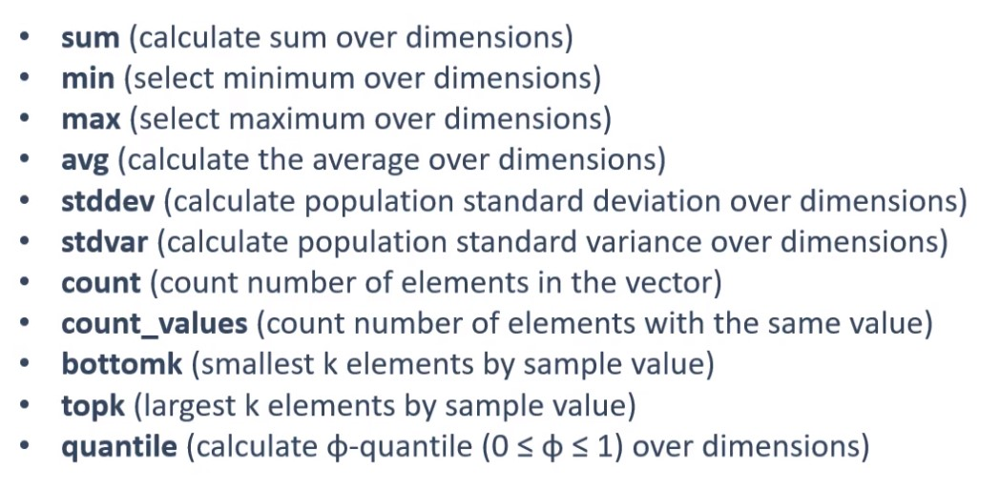
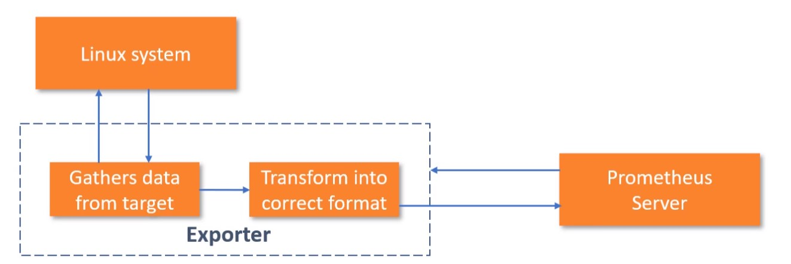

<h1> Architecture </h1>

- **Pull Metrics** means that PS scrapes a target/endpoint to retrieve metric (it does not agents or similar methods to have data pushed to it)
- the exception is that a `Pushgateway` where *Short-live jobs* push metrics to it; PS can then pull metrics from the `pushgateway` in the same way it would pull from normal targets
- `Service Discovery`uses *Kubernetes* or *file_sd* to discover targets (and whether to use direct target scraping or `pushgateay`)

<h1> Query </h1>

- `up` queries targets/endpoints for up/down status: value 1 = up and value 0 down
- `metric_name{key='value'}` (is range selector) such as `process_cpu_seconds_total{job='node_exporter'}` will limit results to matching criteron
  - = (equality) operator, != (not equalityer) operator, =~ (regex matcher), and !~ (inverse of regex matcher)
- `metric_name{key='value'}[time_interval]`
- math operators (+,-,*,/,%,^)
- comparison operators (==, !=, >, <, >=, <=)
- logical/set operator (and, or, unless) vectors ONLY 
    - uses labels to do comparison key/value pairs
    - `ignoring(label)` prevents `label` from affecting comparison
    - `on(...label)` whitelists all label(s) to be used in comparison
- aggregator_functions
<p align="center">
    
</p>

- `sum(prometheus_http_requests_total) by (code)` adds up all 200, 301, and so codes together
- `rate(metric[time_interval])` gives rate/chart of time series data. `irate(metric[time_interval])` calculates rate based off last two data points gathered 
- `changes(metric[time_interval])` amount of changes across time_interval
- `deriv(metric[time_interval])` how metric has been changing across time_interval
- `predict_linear(metric[time_interval], time_interval_to_predict)` predict metric in the future
- `max_over_time`, `min_over_time`, `avg_over_time` accepts `metric[time_interval]` to calculate value
- `sort(metric)` (ascending) and `sort_desc(metric)` to sort data
- `time()` current time in a scalar (not string)
- `day_of_week()` (0 - 6), `day_of_month()` (1 - 31) 

<h1> YML Configs </h1>

- `global` 
    - `scrape_interval` scrape target at interval (applies to all jobs)
    - `evaluation_interval` evaluate rules at interval 
- `rule_files` takes path to **yml** files that contain rules to be evaulated at a given interval
- `scrape_configs` takes definition of jobs and targets

<h1> Exporter </h1>
 
- Take APM (including network) statistics from Linx or Window machine

<p align="center">
    
</p>

```yml
 - job_name: 'node_exporter'
static_configs:
 - targets: ['ip_address:port']
```

<h1> Recording Rules </h1> 

- How to soft reload configurations
    - SIGHUP signal `kill -HUP {{prometheus_pid}}`
    - Post request to reload handler `curl -X POST http://localhost:9090/-/reload` enable Lifecycle API for this to work!

In `prometheus.yml`
```yml
rule_files:
  - "rules/rule01.yml"
  #...
```

recording rules general form: `level:metric:operations`
- level (e.g., job)
- metric (e.g., node_cpu_seconds)
- operations (e.g., avg_idle)
In `rule01.yml`
```yml
groups:
    # -name key denotes a group
  - name: groupsRule
    #rules are processed sequentially
    rules: 
    - record: level:metric:operations
        #takes average idleness of cpus over 5 minutes: without(cpu) tells avg function to ignore cpu level which aggregates cpu metrics into one scalar
      expr: avg without(cpu)(rate(node_cpu_seconds_total{mode="idle"}[5m]))
    - record: second:rule:here
      expr: seocnd expression ...
```

<h1> Alerts </h1> 

In `alerts.yml` 
```yml
groups:
    # -name key denotes a group
  - name: groupAlerts
    #rules are processed sequentially
    rules: 
    - alert: nodeExporterDown
        #evaluates to true when exporter for Linux machine fails and causes alert
      expr: up{job="node_exporter"} == 0
      #optional 'for' key specifies condition holds for true n amount of time
      for: 1m

    - record: job:app_response_latency_seconds:rate1m
      expr: rate(app_response_latency_seconds_sum[1m]) / rate(app_response_latency_seconds_count[1m])

    #the next two alerts refernce a recording rule (stated directly above)
    - alert: AppLatencyAbove5sec
      expr: job:app_response_latency_seconds:rate1m >= 5
      for: 2m
      #below are just examples, but they help in routing alerts
      labels:
        severity: critical
        #could also be called 'exporter_type'
        app_type: linux
        #additional way of grouping e.g., could group both Windows and Linux servers
        category: server
      #optional for making alert more detailed (usefuleness is utilzed by alertmanager)
      annotations:
        summary: 'this thing that happend is bad'
        #go templating
        description: 'this bad thing has instance {{ $labels.instance }} of job {{ $labels.job }} with {{ $value }}'
        app_link: 'http://checkThisGarbageOut:80'

    - alert: AppLatencyAbove2sec
      expr: 2 < job:app_response_latency_seconds:rate1m < 5
      for: 2m
      labels:
        severity: warning
```

<h2> Alert Manager </h2> 

1. wget alertmanager
2. untar
3. cd into alertmanger dir
4. In `prometheus.yml`
```yml
alerting:
  alertmanagers:
  - static_configs:
    - targets:
      - localhost:9093 #default alert manager port is 9093
```
5. `./alertmanager --config-file alertmanager.yml`

```yml
#generates visual routing tree
# https://www.prometheus.io/webtools/alerting/routing-tree-editor/
global:
  smtp_from: 'example@gmail.com'
  smtp_smarthost: smtp.gmail.com:587
  smtp_auth_username: 'example@gmail.com'
  smtp_auth_identity: 'example@gmail.com'
  smtp_auth_password: 'fqkvkumorgaqgkat'
  pagerduty_url: 'url_here'
inhibit_rules:
- source_match: 
    #when a critical alert occurs ...
    severity: 'critical'
  target_match:
    #...mute/stop warning alert...
    severity: 'warning'
    #...when app_type and cateogry are the same for both critical and warning alerts
  equal: ['app_type', 'category']

route:
  # fallback receiver
  receiver: admin
  #how long to wait before sending alterting (allows other alerts in group to be caught in same notification)
  group_wait: 30s #default value
  #how long to wait before alerting on same alert group (after an initial notification has been sent)
  #grouped alerts are held for 5 minutes (by default) before alerting again
  group_interval: 5m #default value
  #how long to send another notification for group (after one has stopped)
  repeat_interval: 4h #defaul value
  routes:
    # Star Solutions.
  - match_re:
      app_type: (linux|windows)
    # fallback receiver 
    receiver: ss-admin
    routes:
    # Linux team
    - match:
        app_type: linux
      # fallback receiver
      receiver: linux-team-admin
      #group by category (e.g., cpu, disk, and memory) to organize alerts
      group_by: [category]

      routes:
      - match:
          severity: critical
        receiver: linux-team-manager
        #continue tells route tree to keep looking for matches
        continue: true #overides default false
      - match:
          severity: warning
        receiver: linux-team-lead

    # Windows team
    - match:
        app_type: windows
      # fallback receiver
      receiver: windows-team-admin
      routes:
      - match:
          severity: critical
        receiver: windows-team-manager
      - match:
          severity: warning
        receiver: windows-team-lead

#takes alerts --> (produce) notifications
receivers:
- name: admin
  email_configs:
  - to: 'example@gmail.com'

- name: ss-admin
  email_configs:
  - to: 'example@gmail.com'

- name: linux-team-admin
  pagerduty_configs:
  - service_key: 'auto_generated_api_key'

- name: linux-team-lead
  slack_configs:
  - channel: '#prometheus'
    api_url: 'webhook_url'
    icon_url: 'icon_url'
    #supports templating
    title: 'custom title'
    text: 'custom text' 

- name: linux-team-manager
  email_configs:
  - to: 'example@gmail.com'

- name: windows-team-admin
  email_configs:
  - to: 'example@gmail.com'

- name: windows-team-lead
  email_configs:
  - to: 'example@gmail.com'

- name: windows-team-manager
  email_configs:
  - to: 'example@gmail.com'
```


